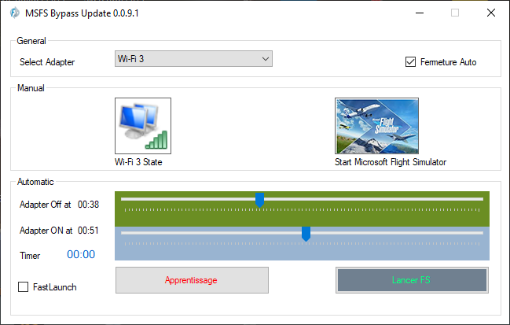
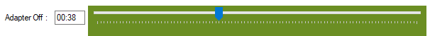
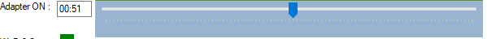

# Microsoft Fligh Simulator ByPass Update

Small application to bypass MS FlightSimulator 2020 Update v.0.0.7

**\*English version\***

This application will allow you to skip updates of Microsoft Flight Simulator 2020.

1\. Purpose
    To prevent Flight Simulator from checking for updates. We cut the internet connection just before this check, then we put it back on just after.
     This process depend of the performance of your system (loading, internet speed...).
    It's run in tow process:
        A) Learning
        First you must learn the moment when FS start the verification update, by use the learn button (*it's activate by select a card*).
        when FS start  play the music, click the Stop button to close the connection
           
        After this wait about 10s, click the same buttonat left bottom corner click the same button when you see this at left bottom cornerat left bottom corner
                

2\. Interface

In this example, at 38s the network conexion is cut after launching the application and it is turned on again at 51s, ie 13s later.

3. Wifi adapter
Choose the network card used

4. Define the start of the adapter shutdown
Time after launch to cut the network. generaly when the music start

5. Define the end stop of the adapter (we turn it on)

6. Learning button
It allows you by clicking to automatically memorize the value of the cut-off period

7. Button to launch the simulator with the chosen parameters

8. Automatic closing after starting MS FS 2020.

9. Install the download

Télécharger la dernière version et déziper le fichier (ex: publisher.0.0.9.1.zip) et lancez le setup!

**Français**

Cette application va vous permettre de sauter les mise à jours de Microsoft Flight Simulateur 2020.
 
1. Principe
Pour empêcher à flight Simulateur de vérifier les mise à jours. On coupe la connexion internet juste avant cet vérification, puis on la remet juste après.
2. Interface

Dans cet exemple, on coupe le réseau 38s apres le lancement de l'application et on le rallume à 51s soit 13s plus tard.

3. Adaptateur Wifi
Choisir la carte réseau utilisée

4. Definir le début d'arrêt de l'adaptateur
Temps après le lancement pour couper le réseau.

5. Definir la fin d'arrêt de l'adaptateur (on l'allume)

6. Bouton d'apprentissage
Il vous permet en cliquant de mémoriser les valeur automatiquement de la période de coupure

7. Bouton pour lancer le simulateur avec les parametres choisis

8. Fermeture automatique après démarrage de MS FS 2020.

9. Install download

Download the latest release , unzip the publier.0.0.9.1.zip and run setup !
